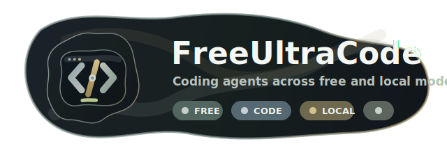

<p align="center">
  
</p>

<h1 align="center">FreeUltraCode</h1>

<h3 align="center">Run coding agents without burning premium quota.</h3>

<p align="center">
  FreeUltraCode gives developers one local chat surface for Claude Code, Codex,
  Gemini, free provider channels, and local models. Use the expensive models
  when they matter. Send the routine work somewhere cheaper.
</p>

<p align="center">
  <strong>English</strong>
  &nbsp;·&nbsp;
  <a href="app/doc/README.zh-CN.md">中文</a>
  &nbsp;·&nbsp;
  <a href="app/doc/README.fr.md">Français</a>
  &nbsp;·&nbsp;
  <a href="app/doc/README.de.md">Deutsch</a>
  &nbsp;·&nbsp;
  <a href="app/doc/README.es.md">Español</a>
  &nbsp;·&nbsp;
  <a href="app/doc/README.pt-BR.md">Português</a>
  &nbsp;·&nbsp;
  <a href="app/doc/README.ru.md">Русский</a>
  &nbsp;·&nbsp;
  <a href="app/doc/README.ja.md">日本語</a>
  &nbsp;·&nbsp;
  <a href="app/doc/README.ko.md">한국어</a>
  &nbsp;·&nbsp;
  <a href="app/doc/README.hi.md">हिन्दी</a>
  &nbsp;·&nbsp;
  <a href="app/doc/README.ar.md">العربية</a>
  &nbsp;·&nbsp;
  <strong><a href="https://discord.gg/2C9ptSEFG">Discord</a></strong>
  &nbsp;·&nbsp;
  <strong>QQ Group: 149523963</strong>
</p>

<p align="center">
  <a href="app/package.json"></a>
  <a href="app/src-tauri/tauri.conf.json"></a>
  <a href="app/package.json"></a>
  <a href="app/package.json"></a>
  <a href="app/package.json"></a>
  <a href="https://discord.gg/2C9ptSEFG"></a>
  
</p>

<p align="center">
  <strong>Free channel routing</strong><br>
  
</p>

<p align="center">
  <strong>Image generation and coding in one session</strong><br>
  
</p>

> [!IMPORTANT]
> **Community · 加入社区** — join the FreeUltraCode Discord or QQ group for setup help, model routing ideas, and contributor coordination. Discord: <https://discord.gg/2C9ptSEFG> · QQ Group: `149523963`

## Why FreeUltraCode

Coding agents are useful, but premium model quota can disappear quickly. FreeUltraCode focuses on a simpler path: keep the chat experience local, then make it easy to route requests through cheaper channels when they are good enough.

- Use free, trial-credit, or low-cost channels such as GitHub Models, Hugging Face Router, SambaNova Cloud, Together AI, Gemini, DeepSeek, Kimi, Groq, OpenRouter, NVIDIA NIM, Z.ai, Kilo, LLM7, Ollama, LM Studio, and llama.cpp.
- Keep API keys and provider settings on your machine.
- Switch runtime, channel, permission mode, and workspace directly from the chat composer.
- Preserve chat history, favorites, scheduled prompts, and workspace context locally.
- Use local models with zero API keys when your hardware supports them.

## What It Can Do

### Coding Chat

- Ask for code edits, bug investigation, refactor help, tests, release notes, or documentation.
- Attach file paths or drag files into the composer.
- Review streamed assistant output, command logs, file references, and generated summaries in one chat surface.
- Continue with follow-up requests in the same session.

### Image Generation + Coding

- Use an image-generation model and a programming model inside the same local conversation.
- Enter image mode when you need visual assets, icons, or design references, then switch back to the coding model to apply those assets to the app.
- Keep the generated image, implementation request, command log, and final code changes in one session history.

### Free-Model Routing

- **20+ remote channels plus local runtimes**: NVIDIA NIM, OpenRouter, GitHub Models, Hugging Face Router, SambaNova Cloud, Together AI, Google Gemini, DeepSeek, Mistral, Mistral Codestral, OpenCode, Wafer, Kimi, Cerebras, Groq, Fireworks, Z.ai, LLM7, Kilo Gateway, plus local runtimes such as Ollama, LM Studio, and llama.cpp.
- **Keyless experimental routes**: LLM7 and Kilo Gateway can be tried without an API key, but should only be used for non-sensitive coding prompts.
- **Official free/trial-credit routes**: GitHub Models, Hugging Face Router, SambaNova Cloud, Together AI, Gemini, Groq, Cerebras, NVIDIA NIM, OpenRouter, Mistral/Codestral, DeepSeek, Kimi, Z.ai, OpenCode, Wafer, and Fireworks use provider keys kept locally in the app.
- Local Rust proxy translates between Anthropic and OpenAI-compatible protocols.
- Claude Code can route through configured free channels without changing the chat UI.
- Provider keys, model overrides, and local model settings are managed from the app settings.

Current default coding-oriented models:

| Channel | Default model |
| --- | --- |
| GitHub Models | `openai/gpt-4.1-mini` |
| Hugging Face Router | `deepseek-ai/DeepSeek-V4-Pro` |
| SambaNova Cloud | `DeepSeek-V3.1` |
| Together AI | `Qwen/Qwen3-Coder-480B-A35B-Instruct-FP8` |
| Kilo Gateway | `poolside/laguna-xs.2:free` |
| LLM7 | `codestral-latest` |

### Dynamic Workflow (/ultracode)

For complex multi-step coding tasks, `/ultracode <task>` generates a purpose-built execution harness on the fly and runs it immediately — no visual canvas needed.

- Describe the task in natural language. The planner builds a harness with parallel subagents, adversarial verification, and acceptance gates.
- Six internal strategies are chosen automatically: classify-and-act, fan-out-and-synthesize, adversarial-verification, generate-and-filter, tournament, and loop-until-done.
- Every run is fully logged under `.fuc-run/<run-id>/` with a task ledger, events, verdict, and final result.
- Run from the desktop app or the CLI: `fuc ultracode "<task>" --json --interactive --cwd <workspace>`.
- Zero config — reuses local `claude` CLI login credentials.

#### Free Auto — Multi-Channel Auto-Switching

The **Auto** channel (`freecc:auto` in the Channel menu) routes each request through the best currently available free channel without manual switching.

- Rotates through all configured free channels, automatically skipping channels that hit rate limits (429) or return upstream errors (5xx).
- Tracks per-channel cooldowns with backoff: when a channel returns an error, it is paused for a cooling period before being retried.
- Supports an optional model override so all auto-routed requests use the same model regardless of which channel handles them.
- If all channels are exhausted, returns a 503 with the failure log so you can diagnose the outage.

#### Multi-Provider Chain: DeepSeek → CodeX

When using `/ultracode`, the harness can chain multiple providers across plan steps automatically. A typical pattern: let DeepSeek produce responsive drafts with low cost, then let CodeX pick up and refine the output for final quality.

- The **Dynamic Harness plan** supports per-step `model` overrides — assign DeepSeek to brainstorming/classification steps and CodeX/Gemini to implementation/verification steps.
- **cc-switch compatibility**: FreeUltraCode reads `cc-switch` CLI config so any provider already configured for Claude Code routing is immediately available for ultracode steps.
- **Fan-out-and-synthesize** strategy parallelizes DeepSeek workers across independent subtasks, then a consensus gate (CodeX) synthesizes and verifies the results.

#### Speed-Aware Channel Selection

The free proxy auto channel prioritizes channels based on real-world availability signals:

- **Rate-limit awareness**: Channels returning 429 are cooling for 30+ seconds before retry, preventing wasted attempts on saturated upstreams.
- **Fail-fast on errors**: Non-retryable errors (4xx auth failures, 5xx upstream down) are tracked per-channel with cooldowns; the auto router skips them for the current request.
- **Connection-time budget**: Each channel attempt is subject to the upstream's timeout; the auto router cycles through candidates without blocking on a single slow upstream.
- **Natural ordering by responsiveness**: Channels that succeed leave the cooldown registry empty and are naturally tried first; channels with errors are deferred to the end of the candidate list.

These features work together so `/ultracode` harness runs stay resilient even when individual free providers are slow, rate-limited, or temporarily unavailable.

### Local-First Workspace

- Sessions, favorites, scheduled prompts, API keys, and workspace history are stored locally.
- No hosted FreeUltraCode server is required.
- The desktop app can use local CLI credentials and local model runtimes already available on your machine.

## Quick Start

Run the web app from `app/`:

```bash
cd app
npm install
npm run dev
```

Vite starts at <http://localhost:5173>.

Run the desktop app:

```bash
cd app
npm run desktop
```

Build a production desktop package:

```bash
cd app
npm run package
```

From the repository root:

```bash
./run.sh        # macOS/Linux: rebuild if needed, then launch
./package.sh    # macOS/Linux: build native bundles (.dmg on macOS)
run.bat         # Windows: rebuild if needed, then launch
build.bat       # Windows: package the NSIS installer
```

## Basic Usage

### Register a Free Channel

1. Open the bottom **Channel** menu and choose a free channel with a warning mark, for example **Free · OpenRouter**.

<p align="center">
  
</p>

2. In the API key dialog, click **Open registration site**.

<p align="center">
  
</p>

3. Create a new API key on the provider page, then copy it.

<p align="center">
  
</p>

4. Paste the key back into FreeUltraCode and click **Save and Use**. After saving, the warning mark disappears from that channel.

<p align="center">
  
</p>

5. You can also manage every free channel from **Settings** -> **Channels** -> **Free Channels**. Channels marked **Ready** have the required configuration.

<p align="center">
  
</p>

After the channel is ready, use the bottom input to chat through that route. See the [free channel registration guide](app/doc/register-free-channel.md) for the full Chinese walkthrough.

### Use Chat for Programming

1. Click **+ New Session** in the left sidebar.
2. Choose the runtime, permission mode, and workspace from the bottom controls. For code edits, make sure the selected workspace is the repository you want to modify.
3. Describe the programming request with enough implementation context: target behavior, affected UI or files, acceptance criteria, and any constraints. Press `Ctrl+Enter` or click the send button.

<p align="center">
  
</p>

4. While the task is running, watch the message stream and command rows. FreeUltraCode shows file reads, searches, edits, checks, and tool calls as separate entries, so you can see what the assistant is doing. Click **Stop** if the request is going in the wrong direction.

<p align="center">
  
</p>

5. After completion, review the summary, changed behavior, and verification commands. If the result needs adjustment, continue in the same chat with a follow-up request.
6. For UI changes, run the app and check the feature directly. In this example, the chat request adds a scheduled task dialog for favorites, then verifies the modal and saved weekly schedule.

<p align="center">
  
</p>

## How It Works

```text
User request
    |
    v
Chat composer
    |
    +--> selected runtime / channel / permission / workspace
             |
             +--> direct provider API, local CLI, or local free-channel proxy
                        |
                        +--> streamed assistant output, tool log, and chat history
```

Free-channel proxy:

- Runs locally and binds to `127.0.0.1:<port>`.
- Routes each channel through `http://127.0.0.1:<port>/ch/<channelId>`.
- Translates Anthropic and OpenAI-compatible streaming protocols.
- Lets Claude Code use non-Anthropic and local providers through the same gateway path.

## Technology Stack

| Area | Technology |
| --- | --- |
| Desktop shell | Tauri 2, Rust |
| Frontend | React 18, Vite 5, TypeScript 5 |
| State | Zustand |
| Styling | Tailwind CSS, CSS variables |
| Icons | lucide-react |
| Provider routing | Claude Code, Codex, Gemini, extensible provider settings |
| Free-channel proxy | Rust `tiny_http` + `ureq`, Anthropic/OpenAI protocol translation |

## Project Structure

```text
app/
  src/
    components/  Shared UI and rich assistant-message rendering
    lib/         Provider settings, free-channel routing, persistence helpers
    panels/      Sidebar, chat dock, settings, scheduling UI
    store/       Zustand state and local history
  src-tauri/
    src/
      free_proxy.rs    Rust reverse proxy + Anthropic/OpenAI translation
      lib.rs           Tauri commands, filesystem/history bridge
  doc/                 Tutorials, localized READMEs, screenshots
docs/                  Research notes, static docs, assets
pencil/                Pencil design files
```

## Documentation

- [Free channel registration guide](app/doc/register-free-channel.md) - Chinese walkthrough for creating and saving a free-channel API key.
- [Chinese README](app/doc/README.zh-CN.md)

## Development

Useful commands from `app/`:

```bash
npm run dev        # Vite dev server
npm run typecheck  # TypeScript check without emitting files
npm run lint       # ESLint for .ts and .tsx files
npm run test       # Vitest suite
npm run desktop    # Tauri development mode
npm run package    # Production Tauri build
```

## Community

- Discord: <https://discord.gg/2C9ptSEFG>
- QQ Group: `149523963`
- Issues: <https://github.com/wellingfeng/FreeUltraCode/issues>
- Repository: <https://github.com/wellingfeng/FreeUltraCode>

Pull requests should describe the behavior change, list verification commands, link related issues, and include screenshots or short recordings for UI changes.

## License

No license has been specified yet.
