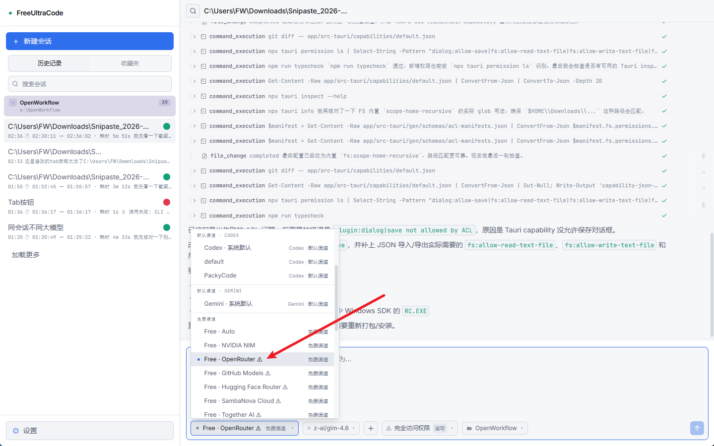
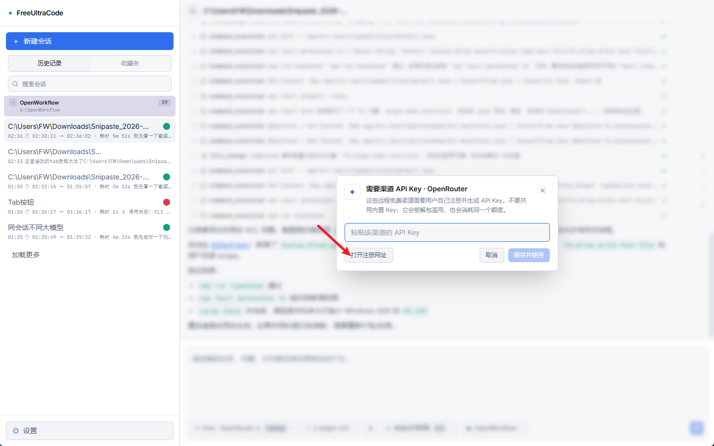
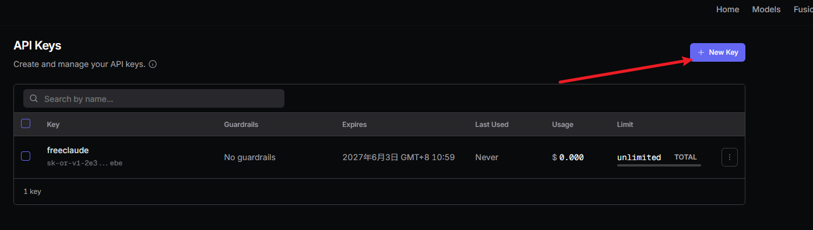
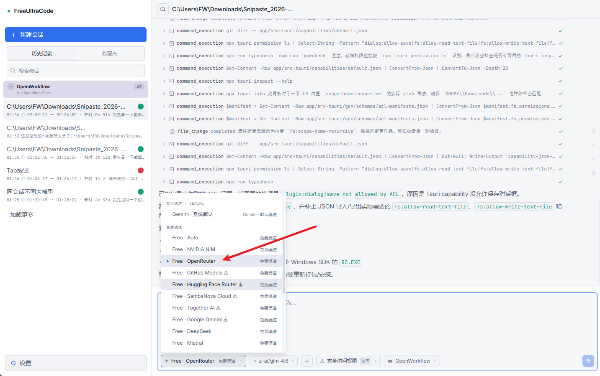
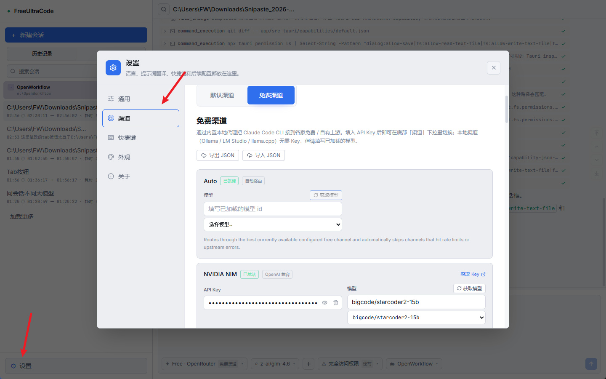

# FreeUltraCode

<div align="center">
  <a href="../../README.md">English</a> | <a href="README.zh-CN.md">中文</a> | <a href="README.fr.md">Français</a> | <a href="README.de.md">Deutsch</a> | <a href="README.es.md">Español</a> | <a href="README.pt-BR.md">Português</a> | <a href="README.ru.md">Русский</a> | 日本語 | <a href="README.ko.md">한국어</a> | <a href="README.hi.md">हिन्दी</a> | <a href="README.ar.md">العربية</a>
</div>

すべてのプログラミング作業に高価なモデルの枠を使う必要はありません。FreeUltraCode は Claude Code、Codex、Gemini、無料チャネル、ローカルモデルを 1 つのローカルチャット画面にまとめます。探索や下書きは安いモデルで行い、重要な判断は安定したモデルに任せられます。

<p align="center">
  <strong>無料チャネルルーティング</strong><br>
  
</p>

## なぜ FreeUltraCode か

Coding agent は便利ですが、プレミアムモデルの枠はすぐに減ります。FreeUltraCode はローカルのチャット体験を保ちつつ、十分な場合は無料枠、試用枠、低コストチャネルへ簡単にルーティングできるようにします。

- GitHub Models、Hugging Face Router、SambaNova Cloud、Together AI、Gemini、DeepSeek、Kimi、Groq、OpenRouter、NVIDIA NIM、Z.ai、Kilo、LLM7、Ollama、LM Studio、llama.cpp を利用できます。
- API キーと provider 設定は自分のマシンに保存されます。
- runtime、channel、permission mode、workspace をチャット入力欄から切り替えられます。
- 履歴、 favorites、scheduled prompts、workspace context をローカルに保持します。
- ハードウェアが対応していれば、ローカルモデルは API キーなしで使えます。

## できること

### プログラミング用 Chat

- コード修正、バグ調査、リファクタ、テスト、リリースノート、ドキュメント作成を依頼できます。
- ファイルパスを指定したり、ファイルを入力欄へドラッグできます。
- ストリーミング出力、コマンドログ、ファイル参照、要約を 1 つのチャット画面で確認できます。
- 同じセッションで続けて相談できます。

### 無料モデルルーティング

- **20+ のリモートチャネルとローカル runtime**: NVIDIA NIM、OpenRouter、GitHub Models、Hugging Face Router、SambaNova Cloud、Together AI、Google Gemini、DeepSeek、Mistral、Mistral Codestral、OpenCode、Wafer、Kimi、Cerebras、Groq、Fireworks、Z.ai、LLM7、Kilo Gateway、Ollama、LM Studio、llama.cpp。
- **キー不要の実験的ルート**: LLM7 と Kilo Gateway は API キーなしで試せますが、機密ではない coding prompt に限定するのが安全です。
- **公式の無料枠または試用枠**: provider key はアプリ内にローカル保存されます。
- ローカル Rust proxy が Anthropic と OpenAI-compatible プロトコルを変換します。
- Claude Code はチャット UI を変えずに、設定済みの無料チャネル経由で利用できます。
- キー、モデル上書き、ローカルモデル設定は settings で管理できます。

現在のプログラミング向けデフォルトモデル:

| チャネル | デフォルトモデル |
| --- | --- |
| GitHub Models | `openai/gpt-4.1-mini` |
| Hugging Face Router | `deepseek-ai/DeepSeek-V4-Pro` |
| SambaNova Cloud | `DeepSeek-V3.1` |
| Together AI | `Qwen/Qwen3-Coder-480B-A35B-Instruct-FP8` |
| Kilo Gateway | `poolside/laguna-xs.2:free` |
| LLM7 | `codestral-latest` |

## クイックスタート

```bash
cd app
npm install
npm run dev
```

デスクトップアプリを起動:

```bash
cd app
npm run desktop
```

本番パッケージを作成:

```bash
cd app
npm run package
```

## 基本的な使い方

### 無料チャネルを登録する

1. 下部の **Channel** メニューを開き、警告マーク付きの無料チャネルを選びます。例: **Free · OpenRouter**。

<p align="center">
  
</p>

2. API key ダイアログで **Open registration site** をクリックします。

<p align="center">
  
</p>

3. provider のページで新しい API key を作成し、コピーします。

<p align="center">
  
</p>

4. FreeUltraCode に key を貼り付け、**Save and Use** をクリックします。保存後、警告マークが消えます。

<p align="center">
  
</p>

5. **Settings** -> **Channels** -> **Free Channels** から全チャネルをまとめて管理できます。

<p align="center">
  
</p>

チャネルが ready になったら、下部の入力欄からそのルートでチャットできます。

### Chat でプログラミングする

1. 左サイドバーの **+ New Session** をクリックします。
2. 下部のコントロールで runtime、channel、permission mode、workspace を選びます。
3. 期待する動作、対象ファイル、受け入れ条件、制約を含めて依頼を書きます。
4. 実行中は、ファイル読み取り、検索、編集、検証が個別のログとして表示されます。
5. 追加修正が必要な場合は、同じチャットで続けて依頼します。

## 仕組み

```text
ユーザーの依頼
    |
    v
Chat composer
    |
    +--> selected runtime / channel / permission / workspace
             |
             +--> provider API, local CLI, or local free-channel proxy
                        |
                        +--> streamed output, tool log, and chat history
```

## 技術スタック

| 領域 | 技術 |
| --- | --- |
| Desktop shell | Tauri 2, Rust |
| Frontend | React 18, Vite 5, TypeScript 5 |
| State | Zustand |
| Styling | Tailwind CSS, CSS variables |
| Icons | lucide-react |
| Provider routing | Claude Code, Codex, Gemini, extensible provider settings |
| Free-channel proxy | Rust `tiny_http` + `ureq`, Anthropic/OpenAI protocol translation |

## プロジェクト構成

```text
app/
  src/
    components/  共通 UI コンポーネント
    lib/         provider 設定、無料チャネル routing、永続化
    panels/      Sidebar、chat dock、settings、scheduling UI
    store/       Zustand state とローカル履歴
  src-tauri/
    src/
      free_proxy.rs    Rust reverse proxy + Anthropic/OpenAI translation
      lib.rs           Tauri commands, filesystem/history bridge
  doc/                 チュートリアル、ローカライズ README、スクリーンショット
```

## ドキュメント

- [無料チャネル登録ガイド 中国語](register-free-channel.md)
- [English README](../../README.md)

## 開発

```bash
npm run dev
npm run typecheck
npm run lint
npm run test
npm run desktop
npm run package
```

## コミュニティ

- Discord: <https://discord.gg/2C9ptSEFG>
- QQ Group: `149523963`
- Issues: <https://github.com/wellingfeng/FreeUltraCode/issues>

## ライセンス

ライセンスはまだ指定されていません。
