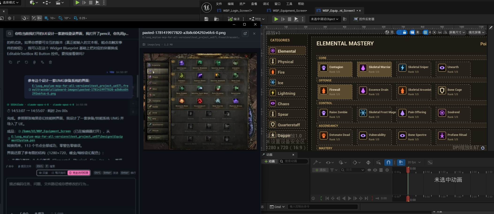
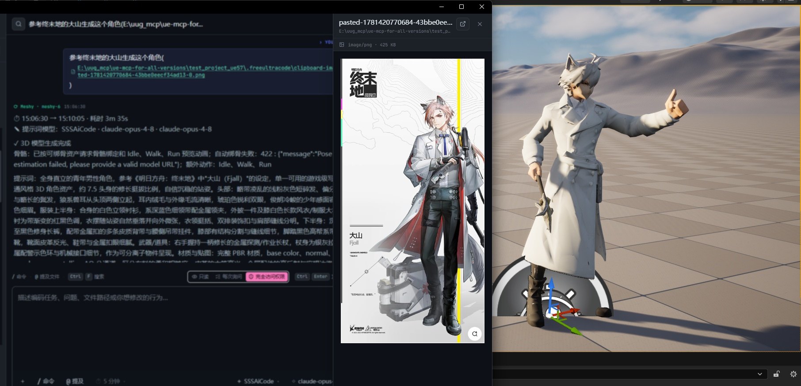
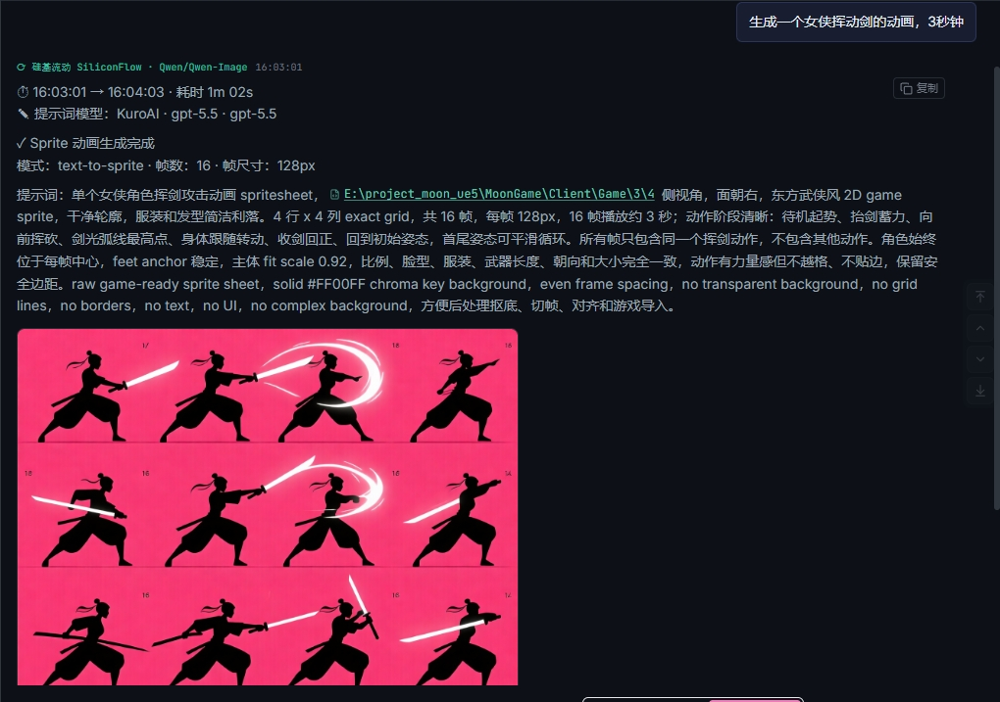
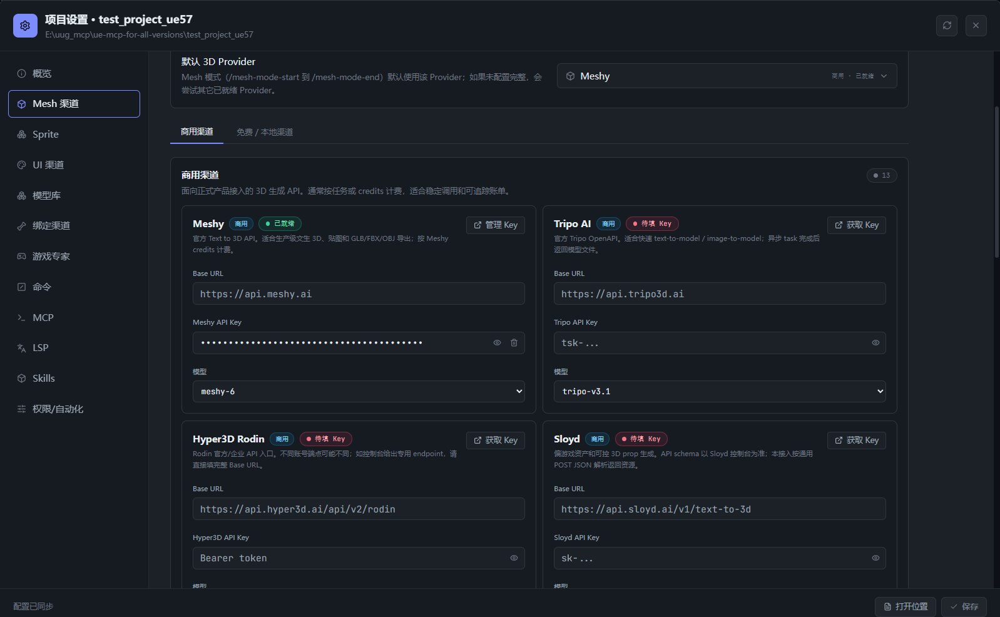
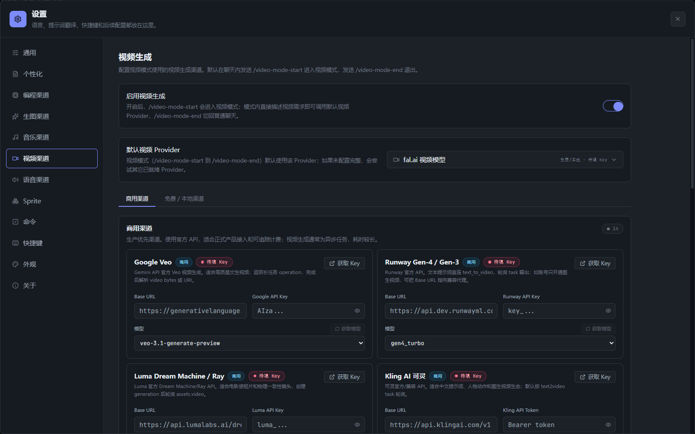
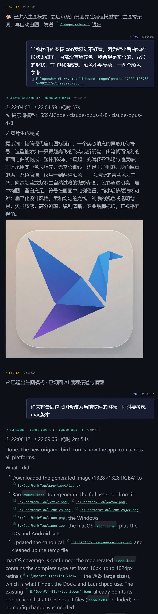

# FreeUltraCode

<div align="center">
  <a href="../../README.md">English</a> | 中文 | <a href="README.fr.md">Français</a> | <a href="README.de.md">Deutsch</a> | <a href="README.es.md">Español</a> | <a href="README.pt-BR.md">Português</a> | <a href="README.ru.md">Русский</a> | <a href="README.ja.md">日本語</a> | <a href="README.ko.md">한국어</a> | <a href="README.hi.md">हिन्दी</a> | <a href="README.ar.md">العربية</a>
</div>

在游戏引擎里，代码只占很小一部分，更多的是资产和流程——材质、蓝图、地形、天空、UI、骨骼动画、打包、性能优化。FreeUltraCode 把 Claude Code / Codex / Gemini 这类编程 Agent 针对这一现实做了深度定制：它理解游戏引擎概念，能生成游戏所需的各类资产（图片、3D 模型、2D 精灵动画、图集、音频、骨骼绑定、视频），并把常规任务路由到免费或低成本渠道，让高级模型额度用在刀刃上。

<p align="center">
  <strong>一键生成虚幻引擎 UMG 界面</strong><br>
  
</p>

<p align="center">
  <strong>一键生成 3D 模型</strong><br>
  
  <br><br>
  
</p>

<p align="center">
  <strong>图片、精灵、网格、音频、骨骼绑定、视频——统一由一个编程 Agent 管理</strong><br>
  
  <br><br>
  
</p>

## 为什么做 FreeUltraCode

如今 AI 已经足够好，大部分代码都能自己写。程序员的角色正在转向描述需求、验证产出、编排 Agent。但游戏不只是代码。游戏引擎里充满了材质、蓝图、地形、天空、UI、骨骼动画、打包和性能调优——而大多数通用编程 Agent 根本不懂这些。

FreeUltraCode 把 Claude Code / Codex / Gemini 这类编程 Agent 针对游戏开发做了深度定制：

- **懂游戏引擎语言。** Agent 预置了游戏开发概念，能推理材质、蓝图、地形、光照、UI（UMG 等）、骨骼动画、构建打包和性能优化，而不只是处理通用源码文件。
- **生成游戏所需的各类资产。** 图片、3D 模型、2D 精灵动画、精灵图集、音频、骨骼绑定、视频都能在同一个聊天界面里产出，并通过一套编程 Agent 工作流统一管理。
- **内置游戏开发专家团。** 40+ 个专家角色（技术总监，玩法/AI/网络/工具程序，关卡/数值设计，美术与音频总监，QA，发布经理等）覆盖 Unity、Unreal、Godot 和 Web 引擎。
- **把高级额度留给关键判断。** 常规任务走免费、试用额度或低成本渠道，Key、设置和历史都保存在本机。

## 主要能力

### 游戏开发 Chat

- 让 AI 写玩法代码、引擎集成、shader/材质逻辑、构建脚本，排查 Bug、重构、补测试、写发布说明。
- 面向 Unity、Unreal、Godot 或 Web 引擎项目——Agent 推理的是引擎概念，而不只是文件。
- 支持附加文件路径，也可以把文件拖进输入区。
- 在同一个聊天界面查看流式输出、命令日志、文件引用和总结。
- 可以在同一个会话里继续追问，不需要重复解释上下文。

### 游戏资产生成

游戏所需的各类资产都能在同一个聊天界面里生成、应用到项目，再交回编程模型——全部保留在同一段会话历史中。每个生成器都通过你配置好的 Provider 运行。

| 资产 | 用途 | 进入方式 |
| --- | --- | --- |
| 图片 | 概念图、UI 草图、图标、海报、贴图、参考图 | `/image`、`/img`、`/draw`、`/生图` 或 `/image-mode-start` |
| ComfyUI 节点图 | 可编辑的节点式生图工作流 | `/comfyui-mode-start` |
| 2D 精灵 | 游戏精灵、序列帧、spritesheet | `/sprite` 或 `/sprite-mode-start` |
| 3D 模型 | 道具、角色、场景网格、blockout | `/mesh-mode-start`（用 `/mesh-search` 搜索素材库） |
| 音乐 | BGM、配乐、音乐片段 | `/music` 或 `/music-mode-start` |
| 语音 | 配音和旁白 | `/speech-mode-start` |
| 视频 | 视频片段和动态素材 | `/video` 或 `/video-mode-start` |

Agent 会先扩写你的提示词，调用配置好的 Provider，并把结果连同提示词和 Provider 信息一起显示在聊天流里。用对应的 `*-mode-end` 命令退出任意模式。

### 游戏开发专家团

FreeUltraCode 内置 40+ 个游戏开发专家，Agent 会根据任务自动调用：

- **引擎专家**：Unity、Unreal、Godot（GDScript / C# / GDExtension / shader）和 Web。
- **程序**角色：技术总监，主程/引擎/玩法/AI/网络/工具/UI 程序。
- **设计**角色：玩法、关卡、数值、运营和叙事设计。
- **美术与音频**总监及专家、特效、音效设计和音频总监。
- **制作、质量与发布**：制作人，QA 负责人/测试，devops，安全，本地化，发布经理。

在 **设置** 里配置当前引擎、council 模式以及启用哪些专家。

### 免费大模型路由

- **20+ 个远程渠道 + 本地运行时**：NVIDIA NIM、OpenRouter、GitHub Models、Hugging Face Router、SambaNova Cloud、Together AI、Google Gemini、DeepSeek、Mistral、Mistral Codestral、OpenCode、Wafer、Kimi、Cerebras、Groq、Fireworks、Z.ai、LLM7、Kilo Gateway，以及 Ollama、LM Studio、llama.cpp 等本地运行时。
- **免 Key 实验渠道**：LLM7 和 Kilo Gateway 可以不填 API Key 直接试用，但只建议用于非敏感编程任务。
- **官方免费/试用额度渠道**：GitHub Models、Hugging Face Router、SambaNova Cloud、Together AI、Gemini、Groq、Cerebras、NVIDIA NIM、OpenRouter、Mistral/Codestral、DeepSeek、Kimi、Z.ai、OpenCode、Wafer、Fireworks 等需要填写 provider API Key，Key 只保存在本机。
- 内置 Rust 本地反向代理，自动翻译 Anthropic 和 OpenAI-compatible 协议。
- Claude Code 可以通过已经配置好的免费渠道路由，不需要改聊天界面。
- API Key、模型覆盖值和本地模型配置都可以在设置里管理。

<p align="center">
  <strong>免费渠道路由</strong><br>
  
</p>

当前默认的编程向模型：

| 渠道 | 默认模型 |
| --- | --- |
| GitHub Models | `openai/gpt-4.1-mini` |
| Hugging Face Router | `deepseek-ai/DeepSeek-V4-Pro` |
| SambaNova Cloud | `DeepSeek-V3.1` |
| Together AI | `Qwen/Qwen3-Coder-480B-A35B-Instruct-FP8` |
| Kilo Gateway | `poolside/laguna-xs.2:free` |
| LLM7 | `codestral-latest` |

### 动态工作流 (/ultracode)

对于复杂的多步骤编程任务，`/ultracode <任务>` 会即时生成一个专属的执行 harness 并立即运行，无需可视化画布。

- 用自然语言描述任务 — planner 自动构建包含并行子代理、对抗验证和验收门的 harness。
- 六种内部策略自动选择：分类执行、扇出合成、对抗验证、生成筛选、锦标赛、循环至完成。
- 每次运行都在 `.fuc-run/<run-id>/` 下完整记录：任务账本、事件、裁决和最终结果。
- 可在桌面端直接使用，或通过命令行：`fuc ultracode "<任务>" --json --interactive --cwd <workspace>`。
- 零配置 — 复用本地 `claude` CLI 登录态。

#### Free Auto — 多渠道自动切换

**Auto** 渠道（Channel 菜单中的 `freecc:auto`）自动将每次请求路由到当前可用的最佳免费渠道，无需手动切换。

- 轮转所有已配置的免费渠道，自动跳过触发频率限制（429）或上游错误（5xx）的渠道。
- 追踪每个渠道的冷却时间并退避：渠道报错后会暂停一段时间再重试。
- 支持可选的模型覆盖，所有自动路由的请求使用同一模型，无论哪个渠道处理。
- 如果所有渠道都已耗尽，返回 503 并附带失败日志，方便诊断中断原因。

#### 多供应商接力：DeepSeek → CodeX

使用 `/ultracode` 时，harness 可以在各计划步骤间自动串联多个供应商。典型模式：让 DeepSeek 以低成本产出响应草案，再由 CodeX 接手精炼至最终质量。

- **动态 Harness 计划**支持按步骤设置 `model` 覆盖 — 将 DeepSeek 分配给头脑风暴/分类步骤，CodeX/Gemini 分配给实现/验证步骤。
- **cc-switch 兼容**：FreeUltraCode 读取 `cc-switch` CLI 配置，已为 Claude Code 路由配置的任何供应商立即可用于 ultracode 步骤。
- **扇出合成**策略将 DeepSeek worker 并行分配到独立子任务上，再由共识门（CodeX）合成并验证结果。

#### 速度感知的渠道选择

免费代理的 Auto 渠道根据实时可用性信号优先选择渠道：

- **频率限制感知**：返回 429 的渠道会冷却 30 秒以上再重试，避免在饱和的上游浪费尝试。
- **错误快速失败**：不可重试的错误（4xx 认证失败、5xx 上游宕机）会追踪每个渠道的冷却时间；Auto 路由会在当前请求中跳过它们。
- **连接时间预算**：每个渠道尝试受上游超时限制；Auto 路由循环候选渠道时不会阻塞在单个慢速上游。
- **响应速度自然排序**：成功的渠道会清空冷却记录，自然优先尝试；出错的渠道推迟到候选列表末尾。

这些功能协同工作，即使个别免费供应商变慢、触发限流或暂时不可用，`/ultracode` harness 运行也能保持韧性。

### 本地优先

- 会话、收藏、定时提示词、API Key 和 workspace 历史都保存在本机。
- 不需要托管版 FreeUltraCode 服务。
- 桌面端可以使用本机已有的 CLI 凭据和本地模型运行时。

## 快速开始

从 `app/` 启动 Web 开发版：

```bash
cd app
npm install
npm run dev
```

Vite 默认运行在 <http://localhost:5173>。

启动桌面端开发模式：

```bash
cd app
npm run desktop
```

打包生产版桌面应用：

```bash
cd app
npm run package
```

在仓库根目录下，也可以使用平台脚本：

```bash
./run.sh        # macOS/Linux：必要时重建，然后启动
./package.sh    # macOS/Linux：打包原生安装包（macOS 产出 .dmg）
run.bat         # Windows：必要时重建，然后启动
build.bat       # Windows：打包 NSIS 安装器
```

## 使用方式

### 注册免费渠道

1. 打开底部 **Channel** 下拉列表，选择一个带警告符号的免费渠道，例如 **Free · OpenRouter**。

<p align="center">
  
</p>

2. 在 API Key 弹窗里点击 **打开注册网址**。

<p align="center">
  
</p>

3. 到平台官网创建新的 API Key，并复制出来。

<p align="center">
  
</p>

4. 回到 FreeUltraCode 粘贴 API Key，点击 **保存并使用**。保存成功后，这个渠道后面的警告符号会消失。

<p align="center">
  
</p>

5. 也可以从左下角 **设置** 进入 **渠道** -> **免费渠道**，集中查看每个渠道的 API Key、默认模型和配置状态。

<p align="center">
  
</p>

渠道状态显示 **已就绪** 后，就可以在底部输入框提问。完整步骤见 [注册并配置免费渠道 API Key](register-free-channel.md)。

### 生成游戏资产

资产模式会把聊天输入区切换成资产生成入口，同时保留同一段会话历史。适合生成 UI 草图、图标、贴图、精灵、3D 模型、音频和视频，然后继续让编程模型把素材用到项目里。下面以生图模式为例，精灵、建模、音乐、语音、视频模式用各自的 `*-mode-start` 命令，用法一致。

1. 打开 **设置** -> **生图渠道**（或对应资产章节），选择默认 Provider，并按渠道要求填写 API Key、Account ID、Base URL 或本地 ComfyUI 地址。配置完整的 Provider 会出现在该模式的底部渠道选择器里。
2. 新建或打开一个 Chat，输入 `/image-mode-start` 进入生图模式。也可以在同一条消息里直接带上第一个需求，例如：

```text
/image-mode-start 奇幻地牢里可平铺的石墙贴图，1024x1024
```

3. 模式开启后，普通文本都会走资产生成，不会触发代码修改。底部 **Channel** 会切换为资产 Provider；如果打开了模型下拉框，还可以在输入区底部切换具体模型。
4. 描述你想要的资产。FreeUltraCode 会先让编程模型扩写提示词，再调用配置好的 Provider 出图。生成结果会和提示词、Provider 信息一起显示在聊天流里。

<p align="center">
  
</p>

5. 输入 `/image-mode-end` 退出生图模式，回到普通 AI 编程渠道和模型。如果只想临时生成一份资产，不进入常驻模式，可以直接发送 `/image`、`/img`、`/draw`、`/生图`、`/sprite`、`/music` 或 `/video` 加上提示词。

## 工作原理

```text
用户请求
    |
    v
聊天输入区
    |
    +--> 选中的 runtime / channel / 权限 / workspace
             |
             +--> 直接 provider API、本地 CLI 或本地免费渠道 proxy
                        |
                        +--> 流式 AI 输出、工具日志和聊天历史
```

免费渠道 proxy：

- 只绑定 `127.0.0.1:<port>`。
- 每个渠道通过 `http://127.0.0.1:<port>/ch/<channelId>` 路由。
- 翻译 Anthropic 和 OpenAI-compatible 流式协议。
- 让 Claude Code 也能通过同一条 gateway 路径使用非 Anthropic 或本地 provider。

## 技术栈

| 范围 | 技术 |
| --- | --- |
| 桌面壳 | Tauri 2, Rust |
| 前端 | React 18, Vite 5, TypeScript 5 |
| 状态 | Zustand |
| 样式 | Tailwind CSS, CSS variables |
| 图标 | lucide-react |
| Provider routing | Claude Code、Codex、Gemini、可扩展 provider settings |
| 免费渠道 proxy | Rust `tiny_http` + `ureq`，Anthropic/OpenAI 协议翻译 |

## 项目结构

```text
app/
  src/
    components/  共享 UI 和富文本 assistant message 渲染
    lib/         Provider 设置、免费渠道路由、资产生成（图片/精灵/3D 网格/音乐/语音/视频/ComfyUI）、游戏开发专家团、持久化辅助函数
    panels/      Sidebar、chat dock、settings、定时任务 UI
    store/       Zustand 状态和本地历史
  src-tauri/
    src/
      free_proxy.rs    Rust 反向代理 + Anthropic/OpenAI 协议翻译
      lib.rs           Tauri 命令、文件系统/历史桥接
  doc/                 教程、本地化 README、截图
docs/                  调研笔记、静态文档、素材
pencil/                Pencil 设计文件
```

## 相关文档

- [注册并配置免费渠道 API Key](register-free-channel.md)
- [英文 README](../../README.md)

## 开发与验证

从 `app/` 运行：

```bash
npm run dev        # Vite 开发服务器
npm run typecheck  # TypeScript 检查
npm run lint       # ESLint
npm run test       # Vitest
npm run desktop    # Tauri 开发模式
npm run package    # 生产打包
```

## 社区

- Discord: <https://discord.gg/2C9ptSEFG>
- QQ Group: `149523963`
- Issues: <https://github.com/wellingfeng/FreeUltraCode/issues>
- Repository: <https://github.com/wellingfeng/FreeUltraCode>

## 许可证

目前尚未指定许可证。
